# Mospolytech Reshuffle

Ежегодно [университет](https://mospolytech.ru/) тратит ресурсы (под ресурсами имеются ввиду и персонал, и время, и
денежные затраты) на выполнение рутинной и трудоёмкой процедуры создания, обновления и проверки материалов для
внутренних вступительных экзаменов, которые представляют собой альтернативу ЕГЭ и являются неотъемлемой частью
большинства ВУЗов. Проект направлен на создание информационной системы, которая позволила бы сократить затрачиваемые
ресурсы и ускорить обработку материалов вступительных экзаменов.

## Использование

Установка требуемых зависимостей:
```pip install -r requirements.txt```

Требуемые зависимости:

* django==5.0.1
* django-ckeditor==6.7.0
* python-decouple==3.8
* psycopg2==2.9.9
* minio==7.2.3
* openpyxl==3.1.2
* opencv-python==4.9.0.80
* easyocr==1.7.1

## Изображения

> **Авторизация** – обеспечение безопасности, разграничение прав пользователей, защита от злоумышленников.

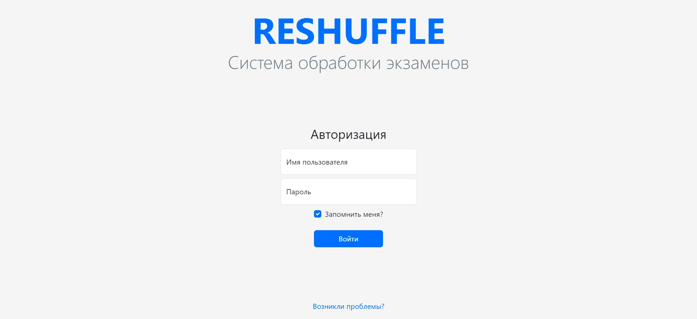 <br><br>

> **Модульность** – наличие модулей для администрирования системы, для создания и скачивания экзаменационных материалов,
> для проверки работ абитуриентов.

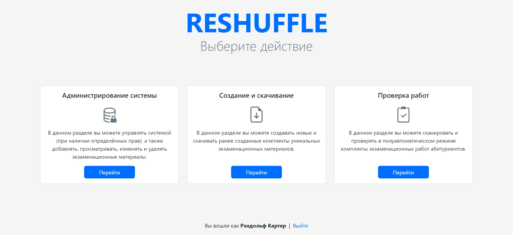 <br><br>

> **Модуль "Администрирование системы"** – визуализация данных системы с возможностью управления пользователями и
> отслеживанием их действий в системе.

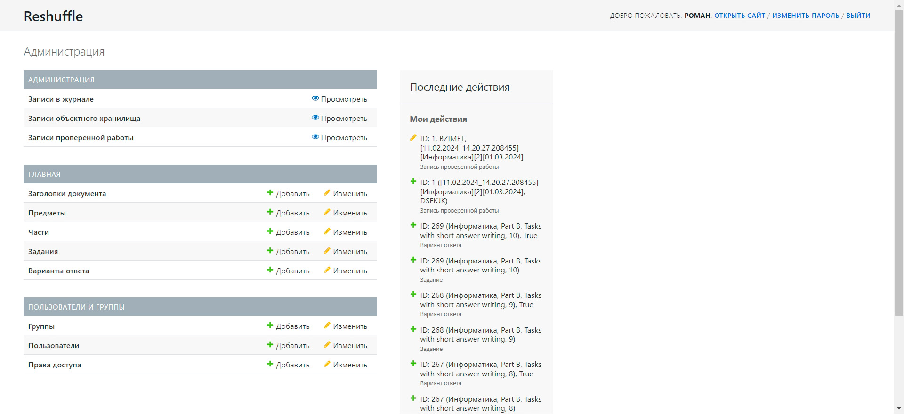 <br><br>

> **Модуль "Администрирование системы"** – возможность управления структурой экзаменационных материалов.

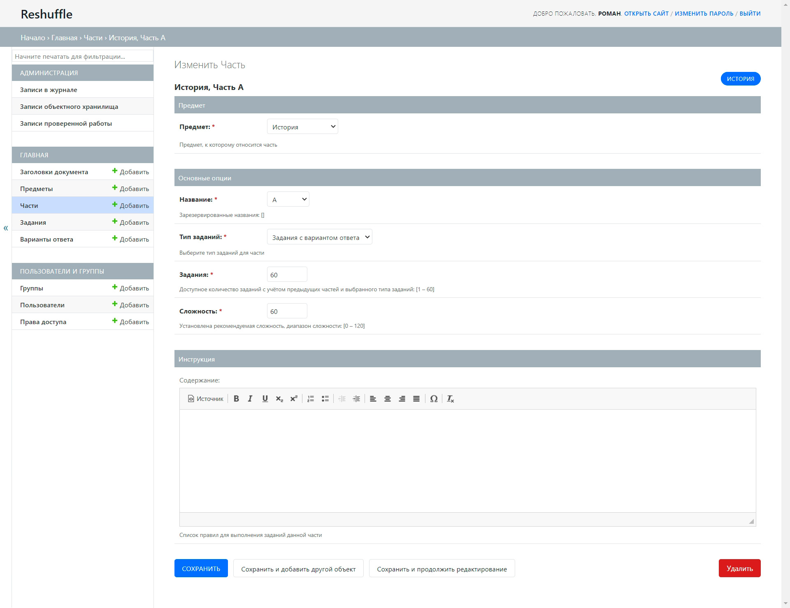 <br><br>

> **Модуль "Администрирование системы"** – возможность создания, чтения, обновления и удаления контента экзаменационных
> материалов.

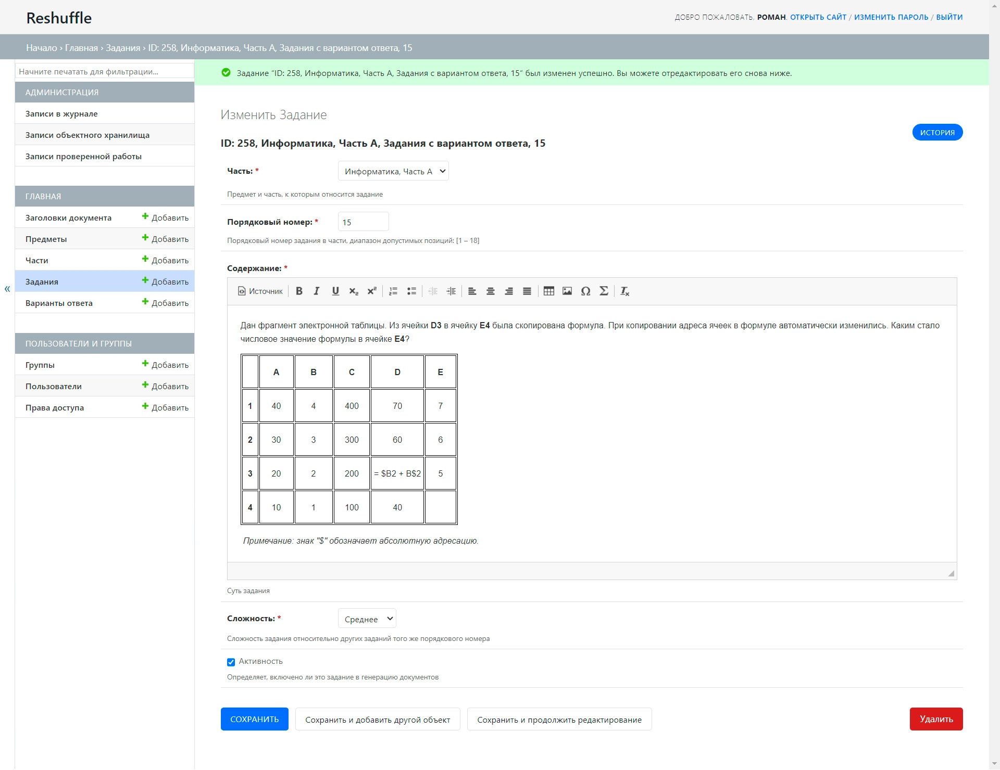 <br><br>

> **Модуль "Создание и скачивание"** – наличие меню для создания уникальных экзаменационных материалов и скачивания уже
> имеющихся.

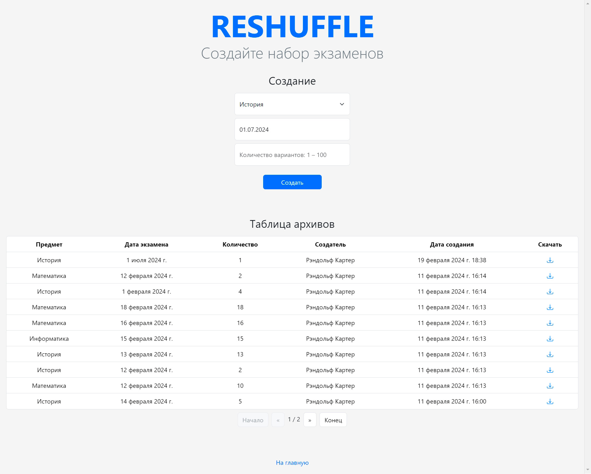 <br><br>

> **Модуль "Создание и скачивание"** – расчёт времени создания комплекта экзаменационных материалов с заданными
> параметрами.

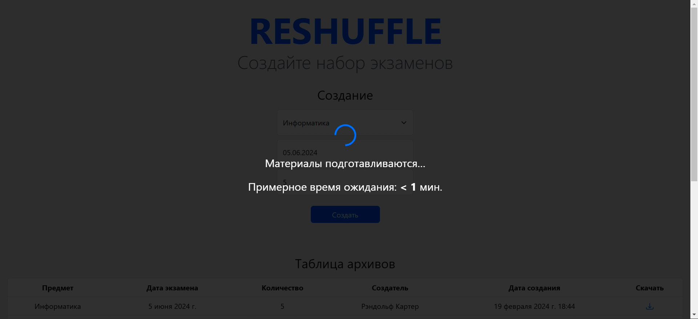 <br><br>

> **Модуль "Создание и скачивание"** – скачивание созданного комплекта в формате zip архива.

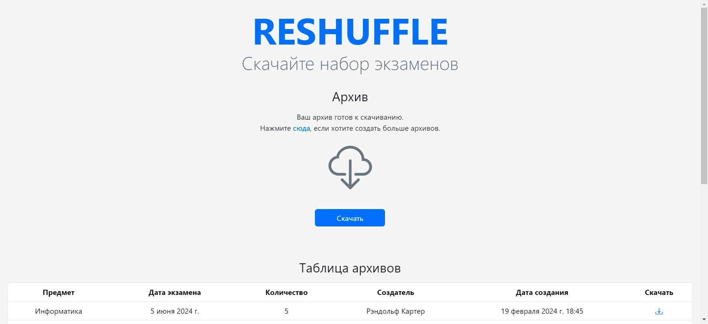 <br><br>

> **Модуль "Создание и скачивание"** – использование S3 хранилища для удобного и надёжного хранения большого объёма
> данных.

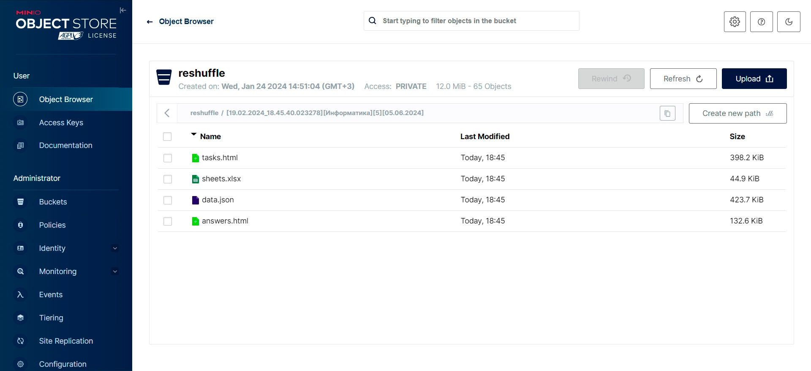 <br><br>

> **Бланк "Задания"** – пример сгенерированного (с учётом сложности заданий) бланка для абитуриентов.

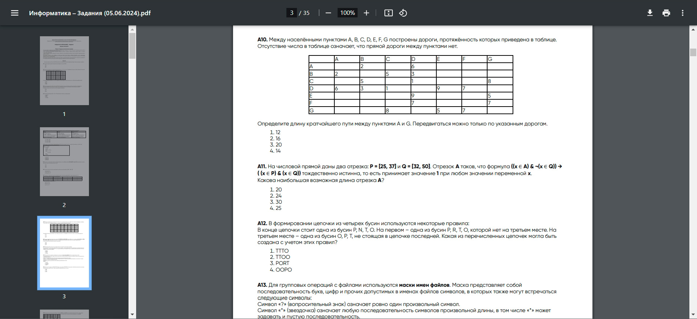 <br><br>

> **Бланк "Ответы"** – пример сгенерированного бланка ответов для проверяющих (при необходимости).

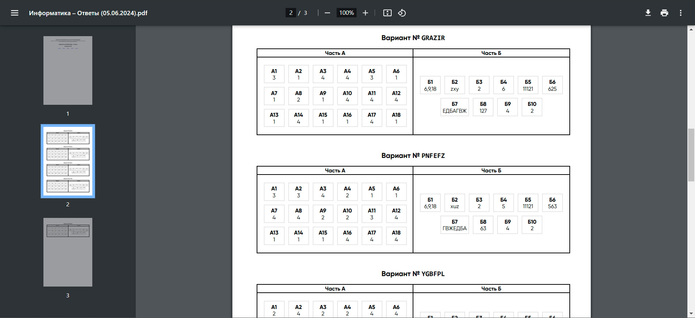 <br><br>

> **Бланк "Вступительные испытания"** – пример сгенерированного (на основе заданной структуры) бланка вступительных
> испытаний для абитуриентов.

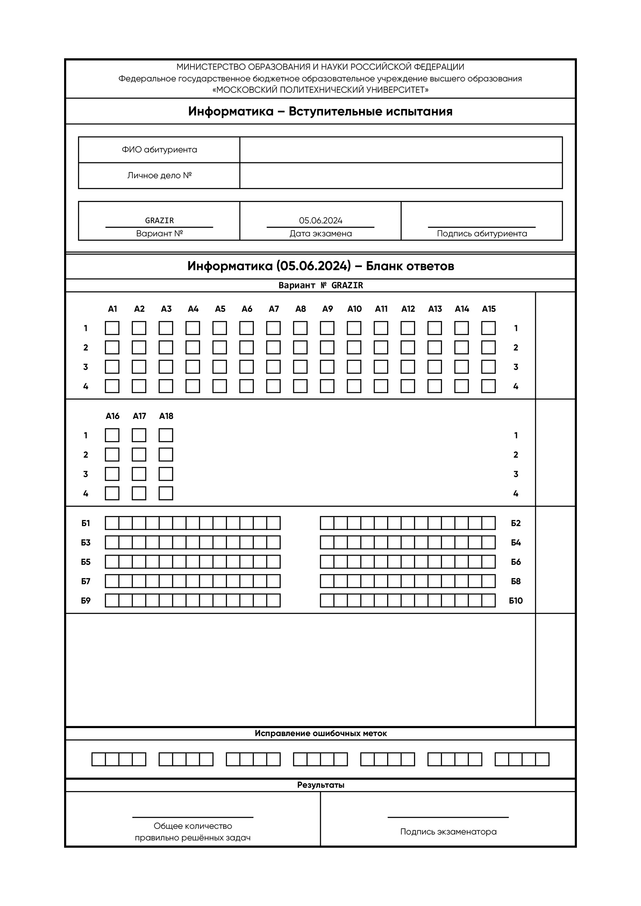 <br><br>

> **Модуль "Проверка работ"** – выравнивание перспективы изображения бланка, полученного с помощью web-камеры или
> загруженного в качестве файла, удаление артефактов изображения, определение маски и анализ результатов работы
> абитуриента с выставлением оценки.

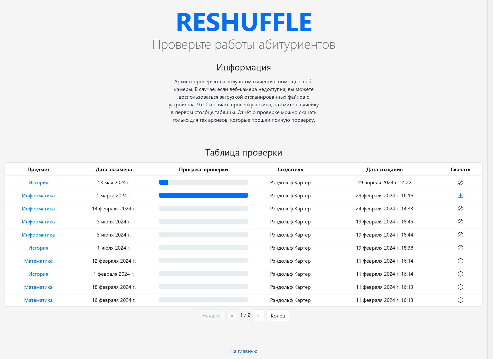 <br><br>

## Контакты

Если вы хотите помочь в разработке или у вас есть вопросы, вы можете связаться с создателем
репозитория ([@rand0lphc](https://t.me/rand0lphc)) в telegram.
